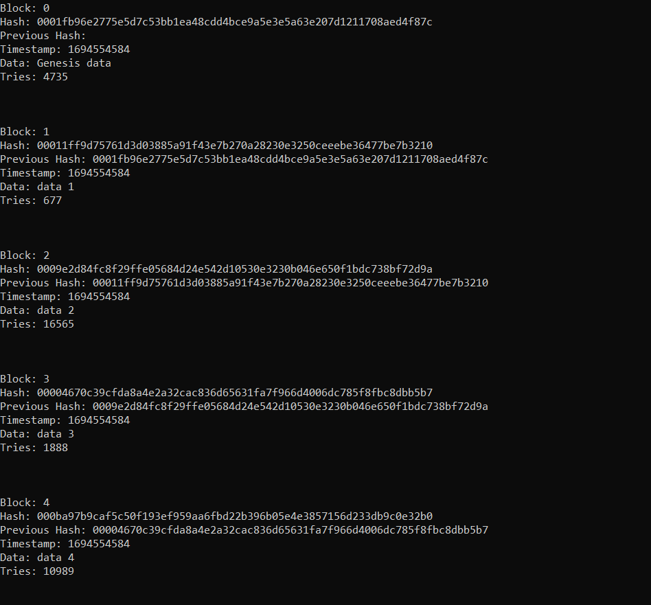

# WHAT DOES IT DO

A simple RUST impl. of blockchain technology. The `main.rs` instance creates a genesis block, then adds 4 more blocks to the chain. If there is a mismatch in the chains it throws panic! Finally, it prints all blocks to the screen



# SIMPLE EXPLANATION FOR main.rs

Create a chain to add blocks:
```rust
let mut my_blockchain = Blockchain {
        chain: Vec::new()
    };
```


Create genesis block:
```rust
my_blockchain.create_genesis();
```

Add block with data:
```rust
my_blockchain.add_block(&String::from("Block data."));
```


Print all blocks:
```rust
my_blockchain.list_blocks();
```
